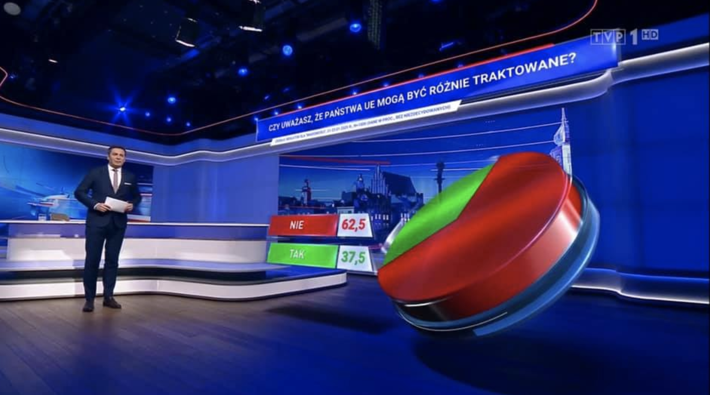

```{r setup, include=FALSE}
knitr::opts_chunk$set(echo = TRUE)
library(ggplot2)
```

## Oryginalny wykres TVP

Źródło: http://smarterpoland.pl/wp-content/uploads/2020/12/a3.png


## Wykres poprawiony


```{r}
Dane <- c(0.375, 0.625)
Kol <- c("TAK", "NIE")

df <- data.frame(Dane, Kol)
ggplot(df, 
       mapping = aes(x = Kol, y = Dane))+
  geom_col() + 
  labs(title = "Czy uważasz, że państwa UE mogą być różnie traktowane?",
       x = " ", y = "Procent ankietowanych") +
  scale_y_continuous(labels = scales::percent)
```


## Dlaczego poprawiony wykres jest lepszy?

* Wykres kołowy 3d z oryginalnego wykresu mógł powodować mylny odbiór informacji - został zamieniony na prosty wykres słupkowy
* usunięta została zbędna legenda - zamiast niej dodano podpisy do słupków.


