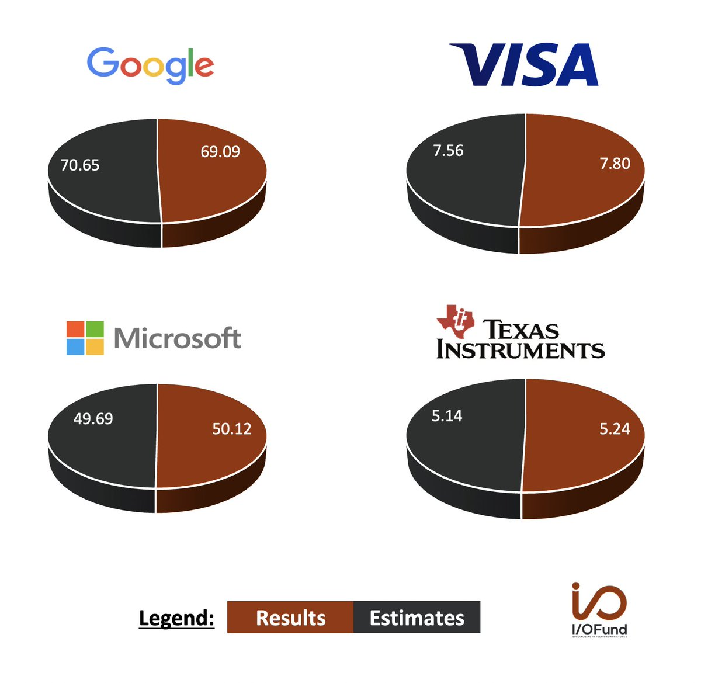

## Wykres źródłowy

Wykres źródłowy pochodzi ze wpisu Beth Kinding w serwisie twitter.com:
https://twitter.com/Beth_Kindig/status/1585012210572865536?s=20&t=Ylt1mslpX15P1CebB13lpA
{ width="700" style="display: block; margin: 0 auto" }

## Poprawiona wizualizacja

```{r pressure, echo=FALSE, fig.align='center'}
 # library
library(ggplot2)

data <- read.csv('data.csv')

ggplot(data, aes(fill=Type, y=Value, x=Company, label=Value)) + 
  geom_bar(position="dodge", stat="identity") + 
  scale_y_continuous(expand = c(0,0,0,5)) +
  geom_text(position = position_dodge2(width = 0.9, preserve = "single"), vjust=-0.5, hjust=0.5) +
  ggtitle("Estimated revenue vs actual revenue of\ncompanies during Q3 of 2022") + 
  ylab("Value (bln dollars)") +
  theme_bw() +
  theme(axis.title.x = element_text(margin = margin(t = 10)),
        axis.title.y = element_text(margin = margin(r = 10)),
        plot.title = element_text(hjust = 0.5))

```

## Uzasadnienie
Autor wizualizacji źródłowej zdecydował się na użycie wykresu kołowego, który jest nieodpowiedni do tego zastosowania, ponieważ dane przestawione na wykresie nie stanowią cząstek całości. Dodatkowo wykres źródłowy jest źle opisany - nie wiadomo, co tak naprawdę przedstawiono na wykresie. Legenda jest odwrócona względem wykresów: na wykresach dane o rzeczywistych przychodach znajdują się po prawej stronie (kolor brązowy), natomiast na legendzie kolor brązowy jest po lewej stronie.

Poszukując źródła danych w internecie udało mi się ustalić, że przedstawione dane obrazują przychody firm w 3 kwartale bieżącego roku. Dane o rzeczywistych przychodach można znaleźć w raportach poszczególnych firm (np: https://abc.xyz/investor/static/pdf/2022Q3_alphabet_earnings_release.pdf), natomiast szacowania przedstawione na wykresie prawdopodobnie odnoszą się do danych firmy Refinitiv. Po wyszukaniu danych w internecie stało się jasne, że podane wartości to miliardy dolarów, czego jednak nie da się odczytać bezpośrednio z wykresu.

Stworzona przeze mnie wizualizacja opiera się na zgrupowanym wykresie słupkowym, który w tym przypadku zapewnia bardziej czytelne przedstawienie danych. Dodatkowo wykres jest dokładniej opisany: zawiera informację, że dane pochodzą z 3 kwartału 2022 oraz jednostkę, w której podawane są wartości.
