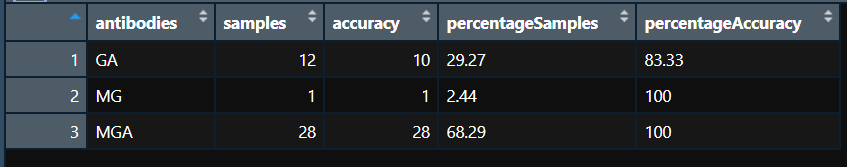

```{r setup, include=FALSE}
knitr::opts_chunk$set(echo = TRUE)
```

## Modyfikacja wykresu pokazującego skuteczność przeciwciał w walce z wirusem COVID-19

Znaleziony przeze Mnie wykres pochodzi z artykułu opublikowanego 25.10.2022. Link do wspomnianego artykułu: <https://medicalxpress.com/news/2022-10-antibody-responses-blood-serum-patients.html?fbclid=IwAR2ejzIsCbgrXplZ52J9CSyuf0ReHr0n4_kL8kuziTFfBeSNiHUXF5mFXmg>.

Wśród licznych danych znalazł się dość nieczytelny wykres kołowy. Zastrzeżenia budzi ilość przekazywanych informacji na jednym obrazku. 


Obwódka koła jest nieczytelna w porównaniu z innymi danymi na wykresie. 
Procenty znajdujące się na częściach koła przekazują wtórnie informacje którą niesie już sam podział koła na części. 
Liczba przebadanych próbek jest nieczytelna w prównaniu z resztą danych w postaci procentowej.
Legenda zdaje się być dość skomplikowana, co utrudnia czytanie wykresu.


## Poprawiony wykres


Zdecydowałem się użyć wykresu kolumnowego, ponieważ łatwiej porównywać na nim wielkości. 
Zamiast procentowego udziału danych antygenów w próbkach, przedstawiłem ilość próbek z danymi antygenami.
Pokolorowałem słupki zgodnie ze skutecznością antygenów. 
Zdecydowałem się użyć minimalnego tła dla wykresu. 
Pokolorowałem legendę dla lepszej widoczności. 
Zastąpiłem ciężkie do rozszyfrowania podpisy antygenów intuicyjną składnią: IgM-IgG+IgA+ => Ig GA.


## Kod wykresu

Ramka danych:


```{r, eval=FALSE}
chart <- df %>% 
  ggplot(aes(x=reorder(antibodies, -samples), y=samples, fill=percentageAccuracy))+
  labs(subtitle = "Accuracy among sets of antibodies \nagainst COVID-19",
       x = "Antibodies (Ig)",
       y = "Samples")+
  theme_classic()+
  geom_col(alpha = 0.7)+
  theme(legend.background = element_rect(fill="#a3d1b1",
                                         size=0.5, linetype="solid", 
                                         colour ="darkblue"))+
  guides(fill=guide_legend(title="Percentage Accuracy"))
chart

```
