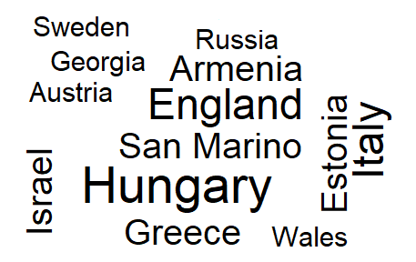
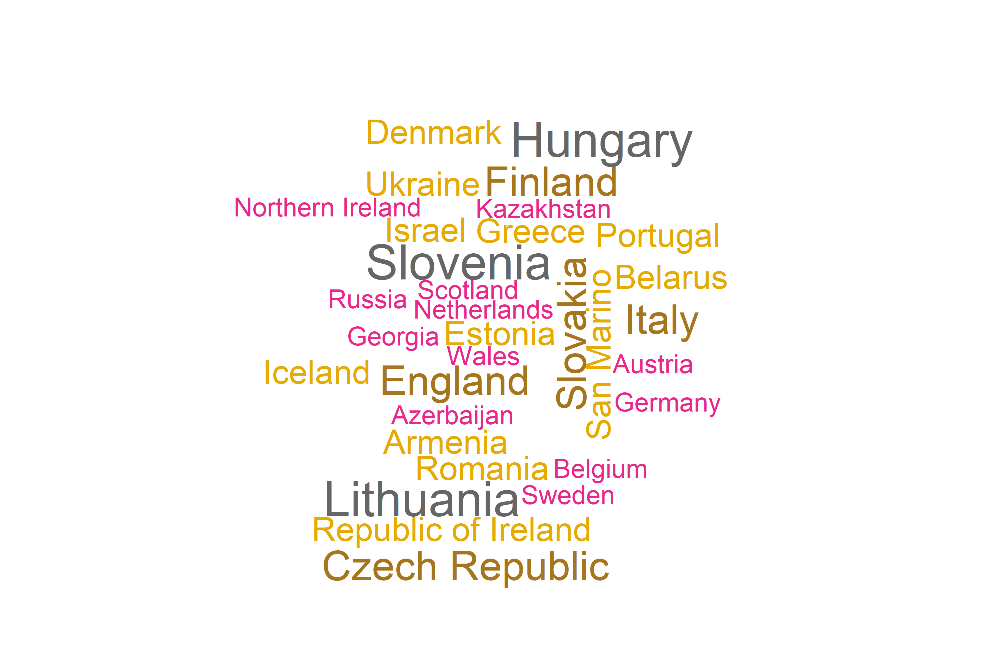

```{r setup, include=FALSE}
knitr::opts_chunk$set(echo = TRUE)
```

## Wstęp

Celem mojego badania było sprawdzenie dokładności odczytu danych z wykresu kołowego 3D oraz kolumnowego. Zbadałem również wpływ kolorów na klasyfikację danych znajdujących się na wykresach.

## Przebieg badania
Najpierw na podstawie znalezionych w internecie danych przygotowałem 4 wykresy. Kołowy 3D, kolumnowy oraz dwie chmury słów. Następnie stworzyłem formularz zawierający wspomniane wykresy. 
Do każdego z nich zadałem respondentom 2 pytania. 

Uzyskałem 32 odpowiedzi w ankietach. Na ich podstawie wyciągnąłem wnioski do postawionych pytań.

## Szacowanie wartości z wykresu


### Ile % udziałów posiada kraj "Germany"?

Poprosiłem respondentów, aby oszacowali wartość przedstawioną na wykresie na podstawie jego wyglądu. Wyniki były następujące:


1. Wykres Kołowy 3D

  wartość dokładna: 17

  procent dobrych odpowiedzi: 6,3%


2. Wykres Kolumnowy

  wartość dokładna: 9

  procent dobrych odpowiedzi: 68,8%%

**Wniosek:**

**Zdecydowanie trafniej szacowane były wartości z wykresu kolumnowego.**

### Ile razy większy udział posiada kraj "Australia", niż "US"?

Poprosiłem respondentów, aby porównali dane wielkości przedstawione na wykresie. Chciałem, żeby ocenili o ile razy dana wielkość jest większa od innej. 


1. Wykres Kołowy 3D

  poprawne porównanie: 2 x większy 

  procent dobrych odpowiedzi: 45,2%


2. Wykres Kolumnowy

  poprawne porównanie: 2 x większy

  procent dobrych odpowiedzi: 77,4%

**Wniosek:**

**Respondenci zdecydowanie lepiej porównywali wielkości na wykresie kolumnowym.**

## Wpływ kolorów na odczyt danych z wykresu





### Wybierz 2 państwa z którymi reprezentacja Polski grała NAJCZĘŚCIEJ.

Poprosiłem respondentów żeby odpowiedzieli na pytanie dotyczące najczęstszego występowania danej wartości na wykresie. Otrzymałem następujące wyniki:

1. Wykres Czarno-Biały

  dobre odpowiedzi: Hungary, Italy, England

  procent dobrych: 72.72%

  procent złych: 27.28%

1. Wykres Kolorowy

  dobre odpowiedzi: Hungary, Lithuania

  procent dobrych: 70%

  procent złych: 30%

### Wybierz 2 państwa z którymi reprezentacja Polski grała NAJRZADZIEJ.

1. Wykres Czarno-Biały

  dobre odpowiedzi: Sweden, Georgia, Austria, Russia, Wales

  procent dobrych: 82.32%

  procent złych: 17.65%

1. Wykres Kolorowy

  dobre odpowiedzi: Hungary, Lithuania

  procent dobrych: 78.94%

  procent złych: 21.06%

**Wniosek:**

**Zastosowanie koloru nie wpłynęło na trafność odczytywanych danych z wykresów. Był to drugi (pomocniczy) zaraz po wielkości napisów wskaźnik użyty na wykresie. Jego dodanie nie zmieniło poprawności odczytu danych.**

**Uwaga**

**Na te pytania odpowiedziało najmniej respondentów, co może wskazywać, na zbyt małą grupę badawczą do uzyskania jednomyślnych rezultatów badania.**

## Kod wykresów


```{r, eval=FALSE}
library("ggplot2")
library("dplyr")
library("tm")
library("wordcloud")
library(grDevices) #png function
library(data.table) #fread

data <- read.csv(file = "dataHw3/international_matches.csv")
answers <- read.csv(file = "dataHw3/HW3TWD.csv")
View(data)
View(answers)
Sweden, Georgia, Austria, Russia, Wales
grepl("^(?=.*\\bswed\\b)(?=.*\\bgeor\\b)(?=.*\\baust\\b)(?=.*\\bruss\\b)(?=.*\\bwale\\b)", x, ignore.case=TRUE, perl=TRUE) 

colnames(answers) <- c("answer","pyt1","pyt2","pyt3","pyt4","pyt5","pyt6","pyt7","pyt8")
answersModyfied <- answers %>% 
  select(Pyt5) %>% 
  

cloudData <- data %>% 
  select("home_team", "away_team", "home_team_continent", "away_team_continent") %>% 
  filter(home_team == "Poland" & away_team_continent == "Europe") %>% 
  group_by(away_team) %>% 
  summarise(amount = n())
View(cloudData)

set.seed(3)
words <- pull(cloudData, "away_team")
freqs <- pull(cloudData, "amount")


png("wordcloudBlank.png", width=12,height=8, units='in', res=300)
par(mar = rep(0, 4))
set.seed(1337)
wordcloud(words = words, freq = freqs, scale = c(3.5, 0.25), 
          max.words = 49)

library(plotrix)
slices <- c(9, 20, 18, 17, 36)
lbls <- c("US", "UK", "Australia", "Germany", "Italy")
pie3D(slices,labels=lbls,explode=0.1,
      main="Pie Chart of Countries ")
data <- data.frame(slices, lbls)
ggplot(data = data,aes(x = lbls, y= slices)) + geom_bar(stat = "identity") + theme_light()
```